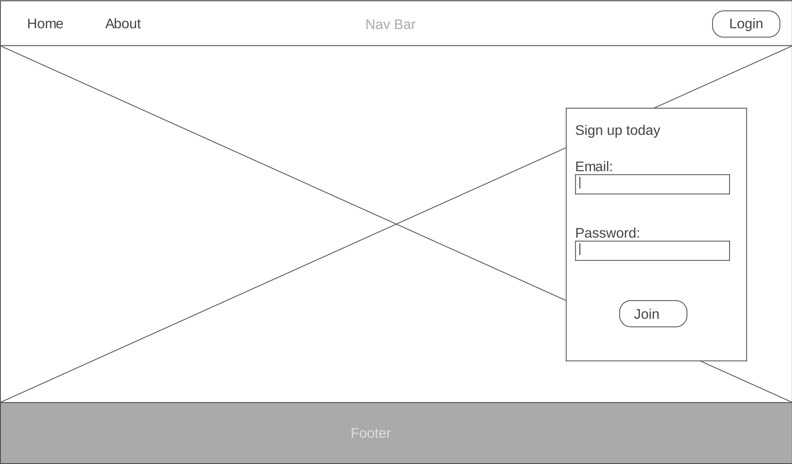
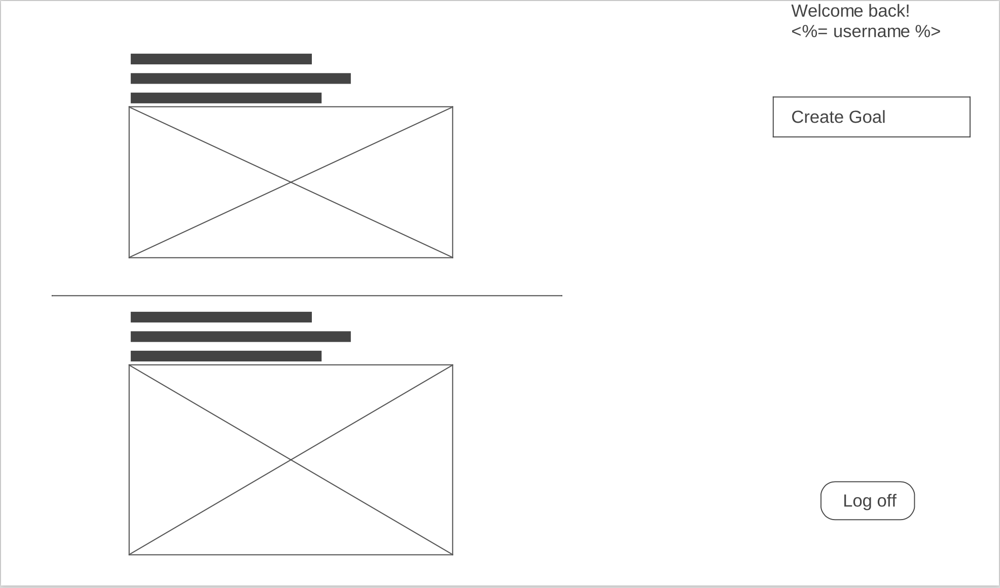

# Project #2: Building Your First Full-stack application
---
https://rocky-beach-48410.herokuapp.com/
---
### Overview
The full-stack application 'GoGoal' is a social network platform which is intended for the public to share their greatest ambition.
Hence, a series of features were establish in order to support the basic functionality of the CRUD app; these features are:
  * Log-in/Sign-up/Log-out function: in order to support people who are keen to make up their own profile.
  * Utilisations of ORM/Interaction of SQL database to ensure users' profile, post and comments to be stored and paired to the correct 'parent' data.
  * CSS and HTML code to support the front-end of the application.
  * Using Heroku to enable the app's accessbility to the public.
___
### Coding Journal
  * The 'Goaler' are firstly exposed to the signup pages and information about the app 'GoGoal'. This part of web-pages was designed and incorporated in `index.erb` folder. (Conceptual wireframe below)
    Sign up/Home page:
      
  * following the sign-up pages, users will be directed to news-feed page(image below). It is been programmed on the same `index.erb` folder like the format below:

    ```HTML
      <% if !logged_in? then %>
        /** code segment for sign-up/home page **/

      <% else %>
      /** code segment for news-feed page **/
      <% end %>
    ```

    News-feed page:
      

  * `main.rb` file was established to enable users to interact with the news-feed (i.e. comment, create goals, delete goals etc.) by send them to a specific address and redirect them to where they were. Meanwhile, the Sinatra/Active.record code interacts with the SQL database. Example below:

    ```ruby
      post '/comments' do
        newComment = Comment.new
        newComment.body = params[:commentBody]
        newComment.goal_id = params[:goal_id]
        newComment.user_id = current_user.id
        if newComment.save
          redirect '/'
        else
          erb :index
        end
      end
    ```
  * One of main feature established was the functionality to track time. With each goals, user are able to set a due date and update their progress in the comment section.

___

### What needs to be improved
  1. Mobile friendly design
  2. Allow users to upload their image in the comment section
  3. CSS code cleanliness
  4. Less orange
